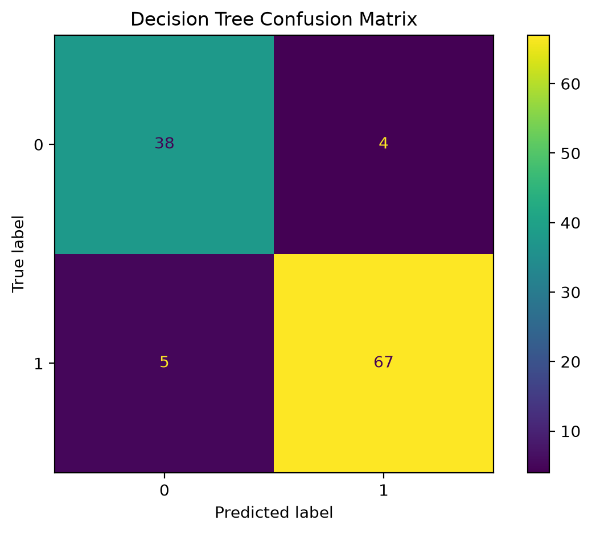
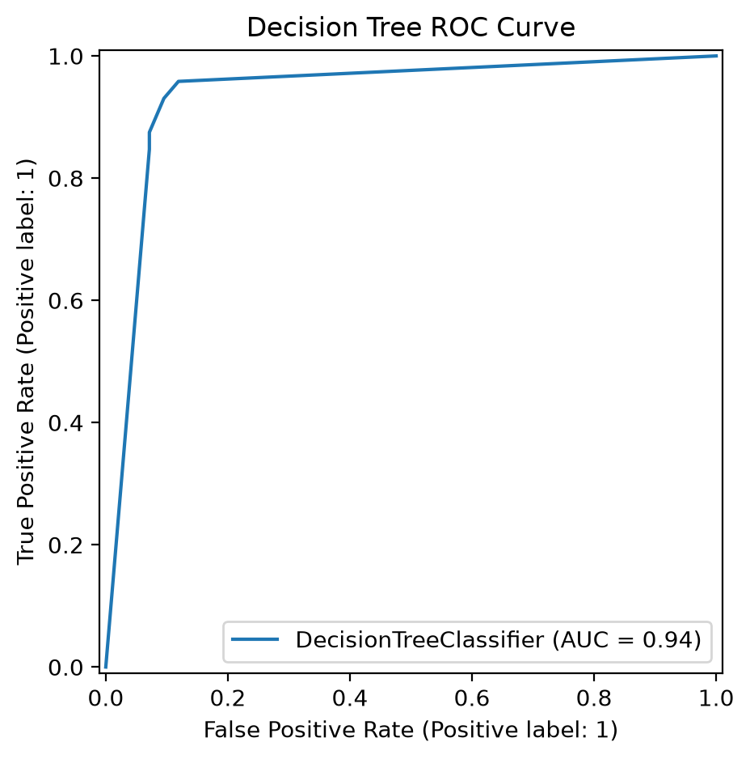
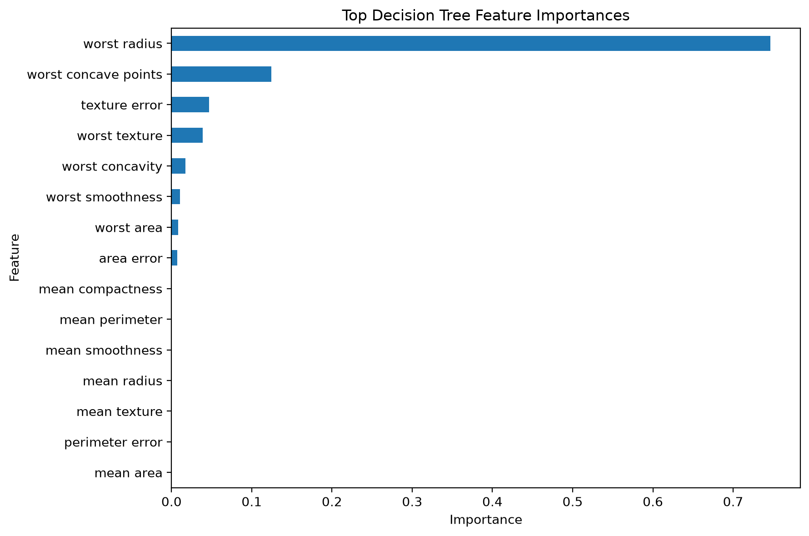
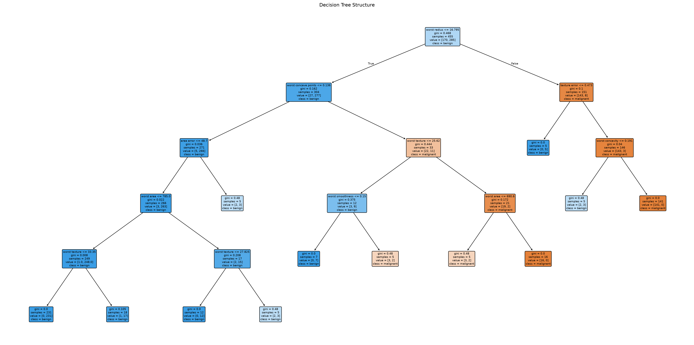

# Decision Tree Classification

## Overview

A Decision Tree is a supervised machine-learning algorithm that classifies observations by repeatedly splitting data according to feature-based rules.

## Business Use Case

A healthcare decision-support system can use patient measurements to classify whether a case is more likely to be benign or malignant.

This example demonstrates model interpretability because the resulting tree can be visualized as a series of decision rules.

## Key Concepts

- Recursive binary splitting
- Gini impurity
- Tree depth
- Leaf nodes
- Overfitting
- Pruning controls
- Feature importance
- Probability prediction

## Evaluation Metrics

- Accuracy
- Precision
- Recall
- F1-score
- ROC-AUC
- Confusion Matrix

## Strengths

- Highly interpretable
- Handles nonlinear relationships
- Requires limited preprocessing
- Supports classification and regression
- Produces feature importance scores

## Limitations

- Can overfit easily
- Sensitive to small data changes
- Greedy splitting may not find a globally optimal tree
- Often less accurate than ensemble methods

## Hyperparameters Used

- `max_depth=5`
- `min_samples_split=10`
- `min_samples_leaf=5`
- `criterion="gini"`

## Results

## Additional Documentation

- [Detailed Result Interpretation](RESULT_INTERPRETATION.md)