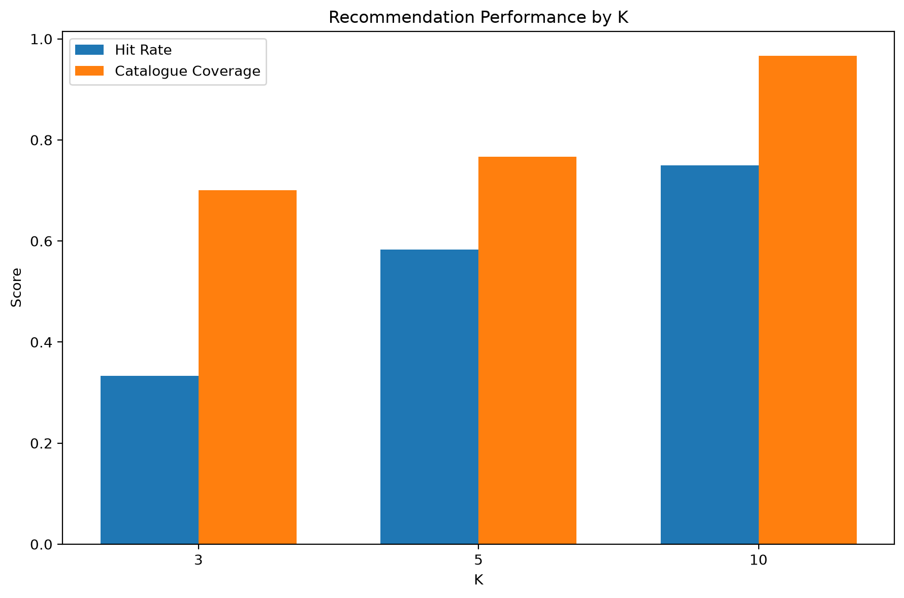
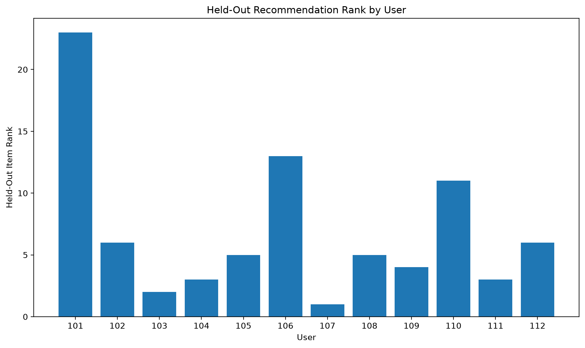
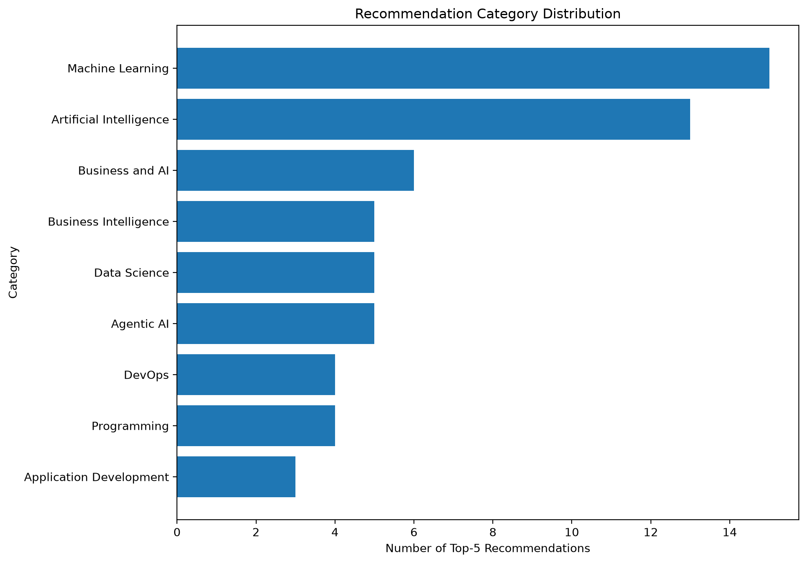

# Content-Based Recommendation System

## Overview

A content-based recommendation system recommends items whose attributes are similar to a user's known preferences.

This implementation recommends AI and technology courses using:

- course titles;
- categories;
- difficulty levels;
- descriptions;
- skill keywords;
- weighted user interactions.

## Recommendation Workflow

```text
Item metadata
      ↓
Combined content text
      ↓
TF-IDF vectors
      ↓
Weighted user profile
      ↓
Cosine similarity
      ↓
Ranked unseen items
```

## Dataset

The project uses a reproducible educational catalogue containing AI, machine-learning, data-science, business, application-development, and DevOps courses.

Each item contains:

- item ID;
- title;
- category;
- difficulty;
- description;
- skill keywords.

## User Interactions

Users can interact with items through:

| Interaction | Weight |
|---|---:|
| Viewed | 1 |
| Liked | 2 |
| Completed | 3 |

Stronger interactions contribute more heavily to the user preference profile.

## Correct Train-Test Design

Each user's interactions are sorted chronologically.

The latest positive interaction is held out for evaluation.

```text
Earlier user interactions
        ↓
Training profile

Latest relevant interaction
        ↓
Held-out test item
```

The held-out item is not used to construct the user profile.

## TF-IDF

TF-IDF gives greater importance to terms that are:

- frequent in one item;
- less common across the full catalogue.

The vectorizer uses unigrams and bigrams.

Examples:

```text
machine
machine learning
agentic ai
semantic search
```

## User Profile

A user profile is a weighted average of the TF-IDF vectors of their training items.

Higher-weight interactions have more influence.

Conceptually:

```text
User profile =
Σ(item vector × interaction weight)
÷
Σ(interaction weights)
```

## Cosine Similarity

Cosine similarity compares the direction of the user-profile vector with each item vector.

General interpretation:

- closer to `1`: more content similarity;
- around `0`: little shared content;
- negative values are uncommon with ordinary non-negative TF-IDF vectors.

## Seen-Item Exclusion

Items already present in the user's training interactions are removed before producing recommendations.

This prevents the system from repeatedly recommending content already consumed.

## Evaluation Metrics

### Precision@K

The proportion of the Top-K recommendations that are relevant.

Because this demonstration contains one held-out item per user:

```text
Precision@K =
Hit / K
```

### Recall@K

Whether the single held-out relevant item appears in the Top-K list.

### Hit Rate@K

The proportion of evaluated users whose held-out item appears in their Top-K recommendations.

### Mean Reciprocal Rank

Rewards systems that place the held-out item near the top of the ranked list.

### Catalogue Coverage

The proportion of catalogue items appearing in at least one user's Top-K recommendations.

### Intra-List Diversity

Measures how dissimilar the recommended items are from one another.

## Output Files

```text
outputs/
├── figures/
│   ├── performance_by_k.png
│   ├── held_out_rank_by_user.png
│   └── recommendation_categories.png
├── metrics/
│   ├── training_summary.json
│   ├── tfidf_vocabulary.csv
│   ├── user_profile_summary.csv
│   ├── user_ranking_metrics.csv
│   └── metrics.json
└── predictions/
    ├── all_user_rankings.csv
    └── example_user_recommendations.csv
```

## Run

```powershell
python 06_recommendation_systems/content_based_filtering/src/train.py
python 06_recommendation_systems/content_based_filtering/src/evaluate.py
python 06_recommendation_systems/content_based_filtering/src/predict.py
```

## Results

### Performance by K



### Held-Out Rank by User



### Recommendation Categories



## Strengths

- Does not require other users with similar histories.
- Works with item descriptions and attributes.
- Can recommend newly added items immediately.
- Provides relatively explainable recommendations.
- Supports domain-specific metadata.
- Protects user profiles from unrelated collaborative behaviour.

## Limitations

- Requires useful item metadata.
- May recommend overly similar items.
- Can create a narrow preference bubble.
- Has difficulty discovering interests outside the user's history.
- TF-IDF does not deeply understand semantic meaning.
- Synthetic interactions do not establish real-world performance.
- New users with no interactions require a cold-start strategy.

## Possible Improvements

- semantic embeddings;
- sentence-transformer item vectors;
- user onboarding preferences;
- diversity re-ranking;
- recency weighting;
- negative feedback;
- category balancing;
- hybrid collaborative recommendations;
- online feedback collection;
- API deployment.

## Additional Documentation

- [Detailed Result Interpretation](RESULT_INTERPRETATION.md)