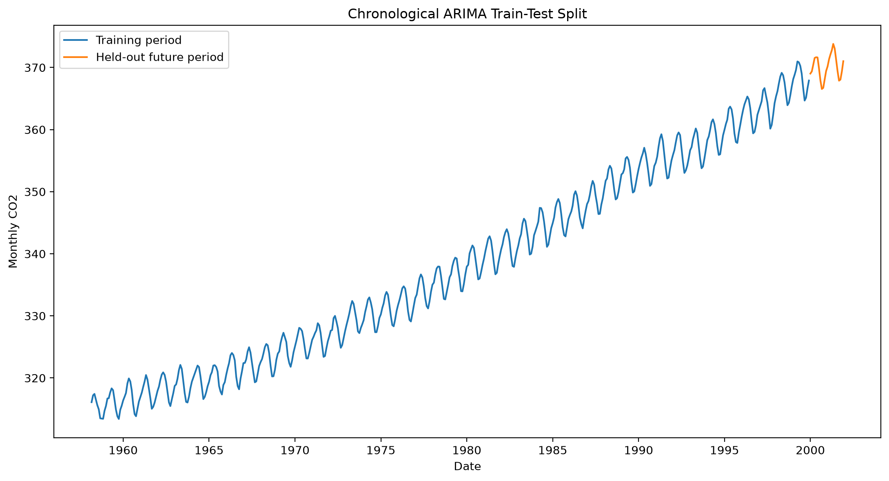
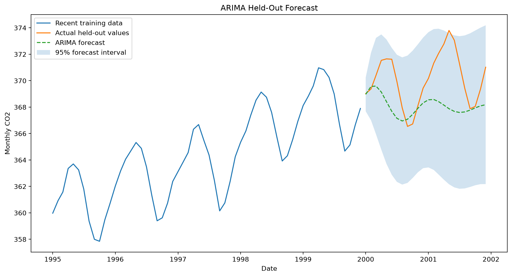
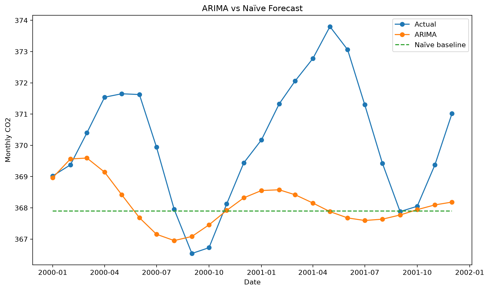
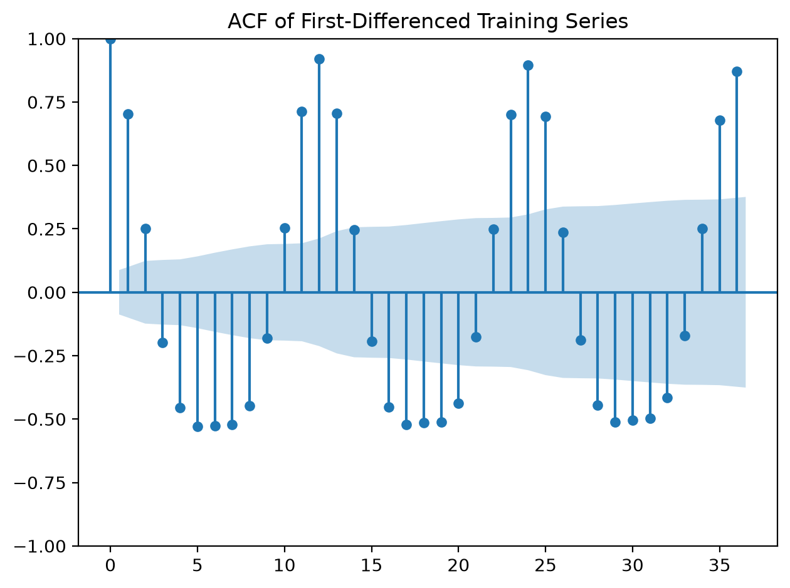
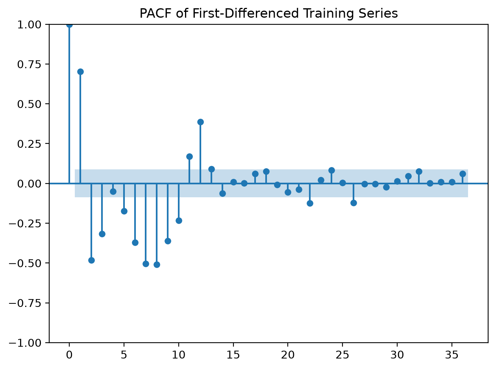
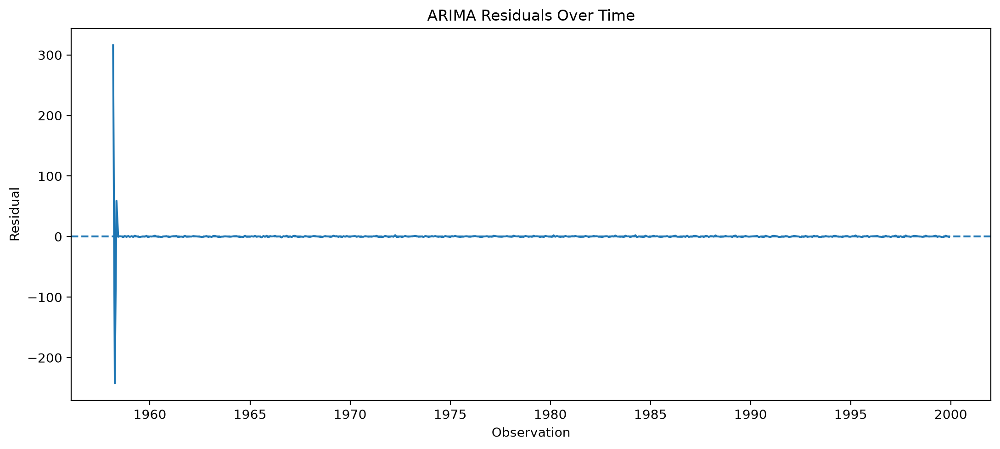

# ARIMA Time-Series Forecasting

## Overview

ARIMA stands for AutoRegressive Integrated Moving Average.

It is a statistical forecasting model designed for chronologically ordered numerical observations.

ARIMA is represented by:

```text
ARIMA(p, d, q)
```

Where:

- `p` is the autoregressive order;
- `d` is the number of differences;
- `q` is the moving-average order.

## Business Problem

An organization needs to forecast future numerical values using historical observations.

Potential applications include:

- demand forecasting;
- sales forecasting;
- workforce forecasting;
- inventory planning;
- economic forecasting;
- environmental forecasting;
- capacity planning.

This implementation uses monthly atmospheric CO2 data as a reproducible time-series example.

## Correct Time-Series Split

Time-series data are not randomly shuffled.

The series is split chronologically:

```text
Past observations → training data
Future observations → held-out test data
```

The final 24 monthly observations are reserved for held-out evaluation.

## ARIMA Components

### Autoregressive Component — `p`

Uses previous observations to predict the current or future value.

### Integrated Component — `d`

Differences the series to reduce non-stationary trend.

### Moving-Average Component — `q`

Uses previous model errors to improve future predictions.

## Model Selection

Several candidate orders are fitted using training data only.

The final candidate is selected using the lowest Akaike Information Criterion.

AIC balances model fit and complexity.

The selected model is then evaluated on future held-out periods.

## Stationarity

ARIMA generally requires the modelled series, after differencing where needed, to behave approximately stationarily.

This project performs the Augmented Dickey-Fuller test on:

- the original training series;
- the first-differenced training series.

## Evaluation Metrics

The project reports:

- MAE;
- MSE;
- RMSE;
- MAPE;
- sMAPE;
- MASE;
- forecast interval coverage;
- improvement over a naïve baseline.

## Naïve Baseline

The naïve forecast predicts every future period using the final observed training value.

The ARIMA model should be compared against this simple baseline.

A complex forecasting model is not useful when it cannot outperform a reasonable baseline.

## Forecast Intervals

The project generates 95% forecast intervals.

The intervals represent forecast uncertainty and generally widen for periods farther into the future.

## Residual Diagnostics

A well-specified ARIMA model should leave residuals with limited remaining predictable time structure.

The project examines:

- residual values over time;
- residual distribution;
- Ljung-Box test results;
- residual mean and variance.

## Output Files

```text
outputs/
├── figures/
│   ├── train_test_split.png
│   ├── held_out_forecast.png
│   ├── arima_vs_naive_forecast.png
│   ├── acf.png
│   ├── pacf.png
│   ├── residuals_over_time.png
│   └── residual_distribution.png
├── metrics/
│   ├── training_summary.json
│   ├── stationarity_tests.json
│   ├── candidate_orders.csv
│   ├── metrics.json
│   ├── residual_summary.json
│   └── ljung_box_test.csv
└── predictions/
    └── test_forecasts.csv
```

## Run the Project

```powershell
python 08_time_series/arima/src/train.py
python 08_time_series/arima/src/evaluate.py
python 08_time_series/arima/src/predict.py
```

## Results

### Chronological Split



### Held-Out Forecast



### ARIMA vs Naïve Forecast



### ACF



### PACF



### Residuals



## Strengths

- Strong statistical foundation.
- Supports autocorrelation.
- Supports differencing for trend.
- Produces forecast intervals.
- Provides interpretable model orders.
- Useful for univariate forecasting.
- Offers detailed diagnostic tools.

## Limitations

- Assumes primarily linear time dependence.
- Requires careful stationarity analysis.
- Sensitive to order selection.
- Ordinary ARIMA does not directly model seasonality.
- Structural changes can reduce performance.
- Long-range forecasts may become uncertain.
- Model performance depends on stable historical patterns.

## Additional Documentation

- [Detailed Result Interpretation](RESULT_INTERPRETATION.md)