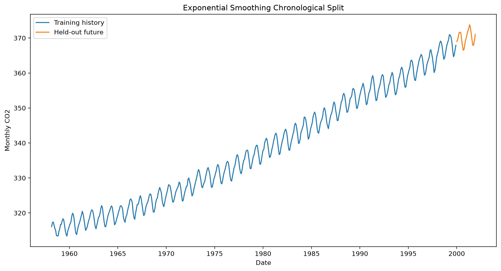
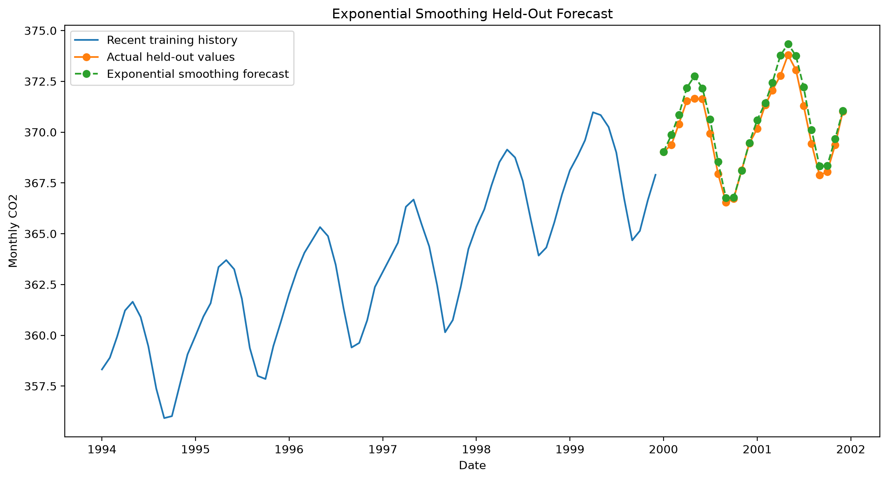
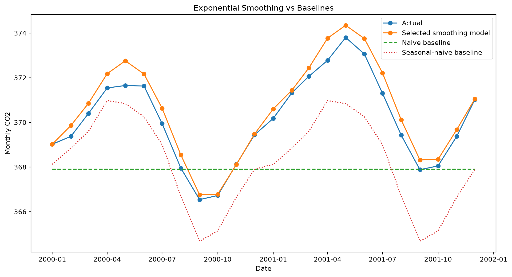
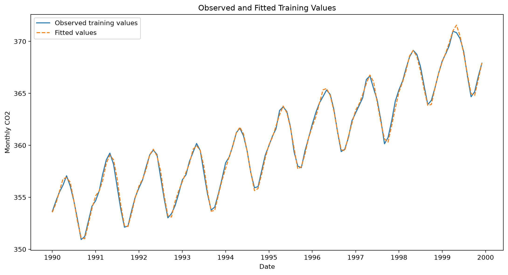
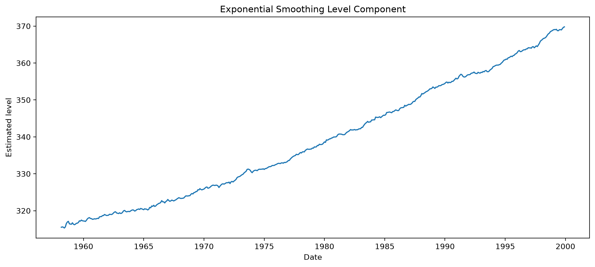
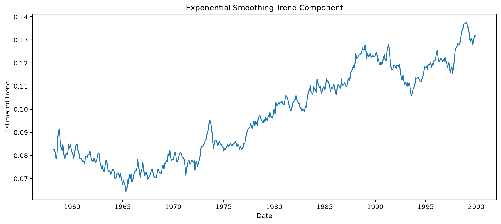
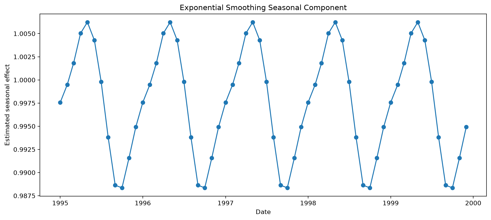

# Exponential Smoothing — Holt-Winters Forecasting

## Overview

Exponential smoothing methods forecast future values using weighted averages of historical observations.

More recent observations usually receive greater weight than older observations.

Different variants model different forms of time-series structure:

- level;
- trend;
- damped trend;
- seasonality.

## Business Applications

Exponential smoothing can support:

- sales forecasting;
- demand planning;
- inventory planning;
- workforce forecasting;
- capacity planning;
- energy-demand forecasting;
- seasonal operations planning.

This implementation uses monthly atmospheric CO₂ data for comparison with ARIMA, Prophet, and SARIMA.

## Correct Time-Series Split

The dataset is separated chronologically:

```text
Past observations → training data
Future observations → held-out test data
```

The final 24 months are reserved for evaluation.

No random shuffling is used.

## Candidate Models

The training workflow compares five models.

### Simple Exponential Smoothing

Models only the current level.

Suitable when the series has no meaningful trend or seasonality.

### Holt Linear Trend

Models:

- level;
- linear trend.

Suitable when a series rises or falls over time.

### Holt Damped Trend

Models level and trend, but gradually reduces the long-term trend effect.

This may prevent unrealistic distant forecasts.

### Holt-Winters Additive

Models:

- level;
- additive trend;
- additive seasonality.

Additive seasonality assumes the seasonal effect has approximately constant magnitude.

### Holt-Winters Multiplicative

Models:

- level;
- additive trend;
- multiplicative seasonality.

Multiplicative seasonality assumes the seasonal effect changes proportionally with the series level.

## Model Selection

Candidate models are fitted using training data only.

The selected model uses the lowest successful corrected Akaike Information Criterion:

```text
AICc
```

When AICc is unavailable, AIC is used.

The selected model is then evaluated on the held-out future period.

A low training information criterion does not guarantee the best future forecast.

## Smoothing Parameters

### Level Smoothing — Alpha

Controls how quickly the estimated level responds to new observations.

A larger value gives greater influence to recent observations.

### Trend Smoothing — Beta

Controls how quickly the estimated trend changes.

### Seasonal Smoothing — Gamma

Controls how quickly the seasonal pattern updates.

### Damping Parameter — Phi

Controls how rapidly a damped trend weakens into the future.

## Baselines

The model is compared with:

1. naïve forecasting;
2. seasonal-naïve forecasting.

The seasonal-naïve model repeats values from the corresponding month of the previous year.

## Evaluation Metrics

The project reports:

- MAE;
- MSE;
- RMSE;
- MAPE;
- sMAPE;
- seasonal MASE;
- improvement over the naïve baseline;
- improvement over the seasonal-naïve baseline.

## Residual Diagnostics

The project evaluates:

- residual values over time;
- residual distribution;
- residual mean and standard deviation;
- Ljung-Box autocorrelation tests.

A useful model should leave limited predictable structure in its residuals.

## Forecast Intervals

This project uses the classic statsmodels Holt-Winters implementation.

The current workflow produces point forecasts but does not calculate forecast intervals.

Forecast uncertainty can be added later using:

- bootstrapping;
- simulation;
- ETS state-space models;
- empirical residual intervals.

## Output Files

```text
outputs/
├── figures/
│   ├── train_test_split.png
│   ├── held_out_forecast.png
│   ├── baseline_comparison.png
│   ├── fitted_values.png
│   ├── level_component.png
│   ├── trend_component.png
│   ├── seasonal_component.png
│   ├── residuals_over_time.png
│   └── residual_distribution.png
├── metrics/
│   ├── training_summary.json
│   ├── candidate_models.csv
│   ├── smoothing_parameters.json
│   ├── metrics.json
│   ├── residual_summary.json
│   ├── ljung_box_test.csv
│   └── fitted_components.csv
└── predictions/
    └── test_forecasts.csv
```

## Run

```powershell
python 08_time_series/exponential_smoothing/src/train.py
python 08_time_series/exponential_smoothing/src/evaluate.py
python 08_time_series/exponential_smoothing/src/predict.py
```

## Results

### Chronological Split



### Held-Out Forecast



### Baseline Comparison



### Fitted Values



### Level Component



### Trend Component



### Seasonal Component



## Strengths

- Fast and computationally efficient.
- Easy to understand.
- Supports level, trend, and seasonality.
- Produces smooth forecasts.
- Works well for many operational series.
- Requires fewer parameters than SARIMA.
- Provides interpretable smoothing parameters.

## Limitations

- Primarily models smooth historical structure.
- Sensitive to model-variant selection.
- Can respond poorly to sudden structural breaks.
- Does not use external predictors directly.
- Multiplicative models require positive values.
- Long-range trends may become unrealistic.
- This implementation does not produce forecast intervals.

## Additional Documentation

- [Detailed Result Interpretation](RESULT_INTERPRETATION.md)