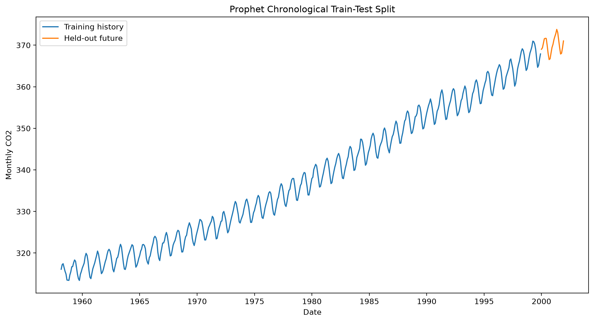
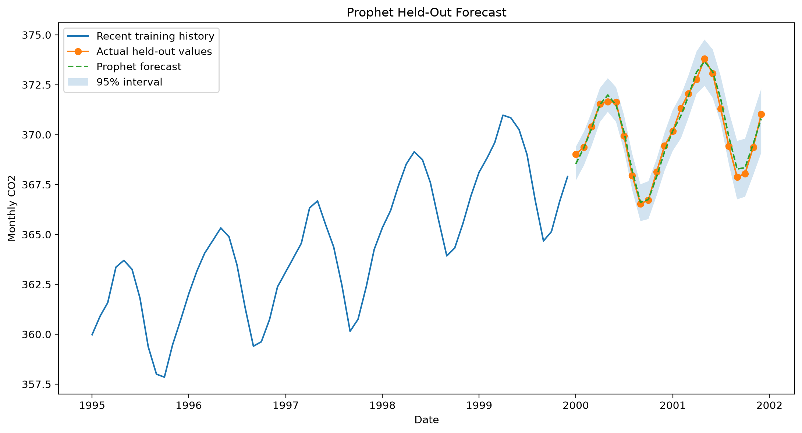
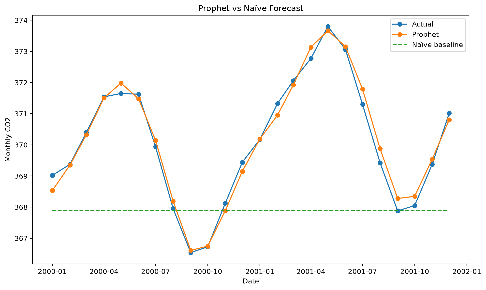
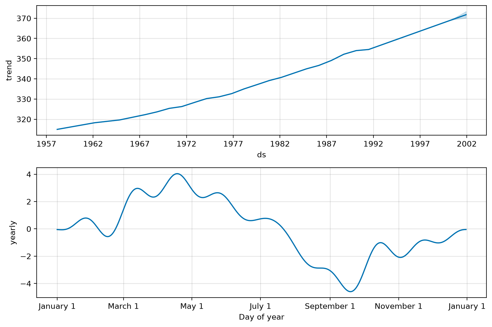
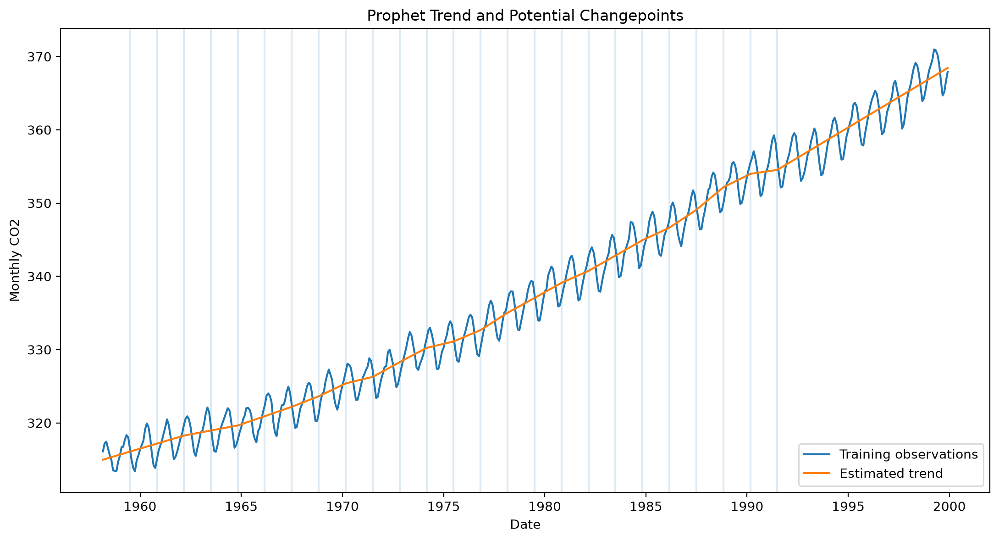

# Prophet Time-Series Forecasting

## Overview

Prophet is an additive time-series forecasting model designed to represent trend, seasonality, holiday effects, and uncertainty.

The model can be represented conceptually as:

```text
Observed value =
Trend
+ Seasonality
+ Holiday effects
+ Error
```

This implementation forecasts monthly atmospheric CO₂ values and compares Prophet with a naïve baseline.

## Business Applications

Prophet can support:

- sales forecasting;
- demand planning;
- workforce forecasting;
- web-traffic forecasting;
- operational capacity planning;
- seasonal business analysis;
- inventory forecasting.

## Correct Time-Series Split

The dataset is divided chronologically.

```text
Past observations → training data
Future observations → held-out test data
```

The final 24 months are reserved for future evaluation.

No random shuffling is used.

## Prophet Data Format

Prophet expects:

| Column | Meaning |
|---|---|
| `ds` | Date or timestamp |
| `y` | Observed numerical value |

## Model Configuration

```python
Prophet(
    growth="linear",
    yearly_seasonality=True,
    weekly_seasonality=False,
    daily_seasonality=False,
    seasonality_mode="additive",
    seasonality_prior_scale=10.0,
    changepoint_prior_scale=0.05,
    interval_width=0.95,
    uncertainty_samples=1000,
)
```

## Trend

The trend component represents the long-term direction of the series.

Prophet can allow the trend slope to change at estimated changepoints.

## Seasonality

This monthly dataset uses yearly seasonality.

Weekly and daily seasonalities are disabled because they are not meaningful for monthly observations.

## Changepoints

Changepoints are dates where the model allows the trend growth rate to change.

`changepoint_prior_scale` controls trend flexibility.

Smaller values create smoother trends.

Larger values allow more rapid trend changes.

## Additive Seasonality

The model uses additive seasonality.

Seasonal effects are added to the estimated trend.

Multiplicative seasonality may be more appropriate when seasonal variation grows in proportion to the series level.

## Evaluation Metrics

The project reports:

- MAE;
- MSE;
- RMSE;
- MAPE;
- sMAPE;
- MASE;
- uncertainty-interval coverage;
- improvement over a naïve baseline.

## Naïve Baseline

The naïve model predicts every held-out month using the final training observation.

Prophet should be compared against this simple benchmark.

## Output Files

```text
outputs/
├── figures/
│   ├── train_test_split.png
│   ├── held_out_forecast.png
│   ├── prophet_vs_naive.png
│   ├── forecast_components.png
│   ├── trend_changepoints.png
│   ├── residuals_over_time.png
│   └── residual_distribution.png
├── metrics/
│   ├── training_summary.json
│   ├── metrics.json
│   └── residual_summary.json
└── predictions/
    └── test_forecasts.csv
```

## Run

```powershell
python 08_time_series/prophet/src/train.py
python 08_time_series/prophet/src/evaluate.py
python 08_time_series/prophet/src/predict.py
```

## Results

### Chronological Split



### Held-Out Forecast



### Prophet vs Naïve



### Forecast Components



### Trend and Changepoints



## Strengths

- Clear trend and seasonal components.
- Automatically handles trend changes.
- Supports missing observations.
- Produces uncertainty intervals.
- Supports holiday and event effects.
- Accessible model configuration.
- Useful for business time series.

## Limitations

- May underperform specialized statistical models.
- Trend flexibility requires tuning.
- Forecasts assume historical seasonal patterns continue.
- Structural breaks may reduce reliability.
- Ordinary Prophet is not automatically superior to naïve or ARIMA models.
- Monthly data may contain limited observations per seasonal cycle.
- Forecast uncertainty depends on modelling assumptions.

## Additional Documentation

- [Detailed Result Interpretation](RESULT_INTERPRETATION.md)