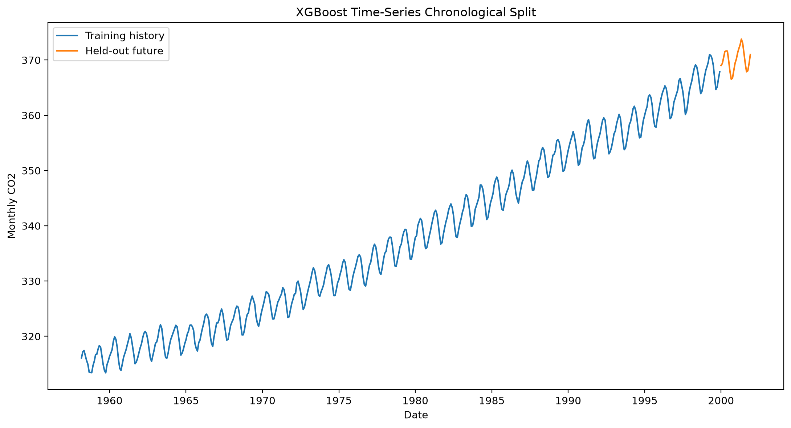
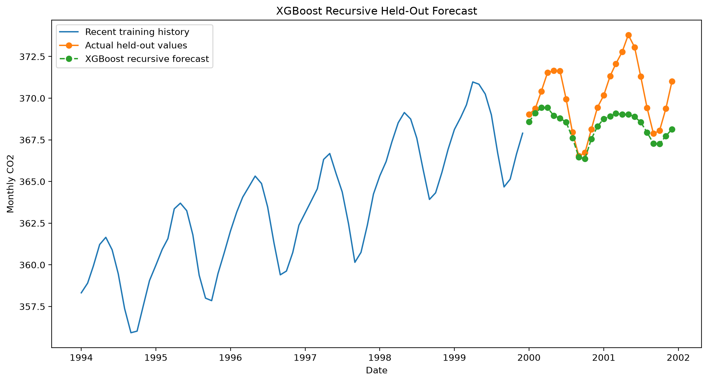
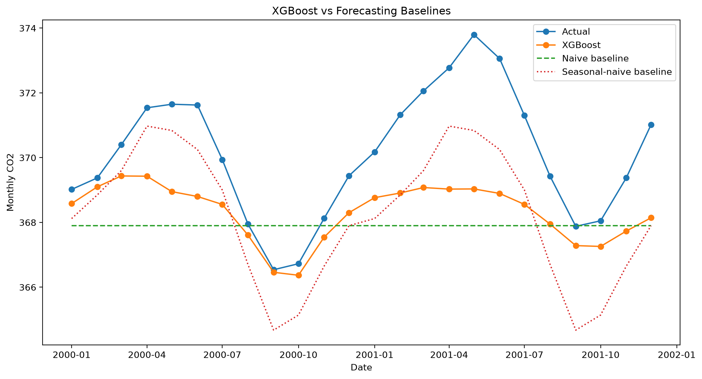
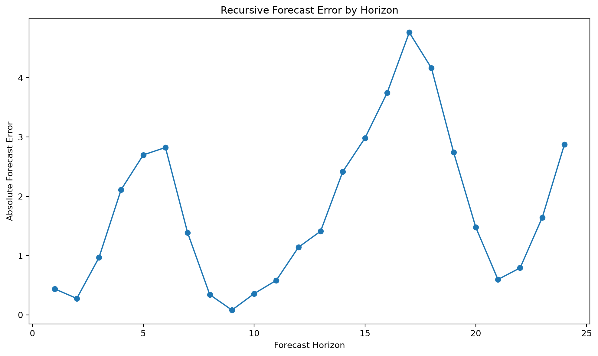
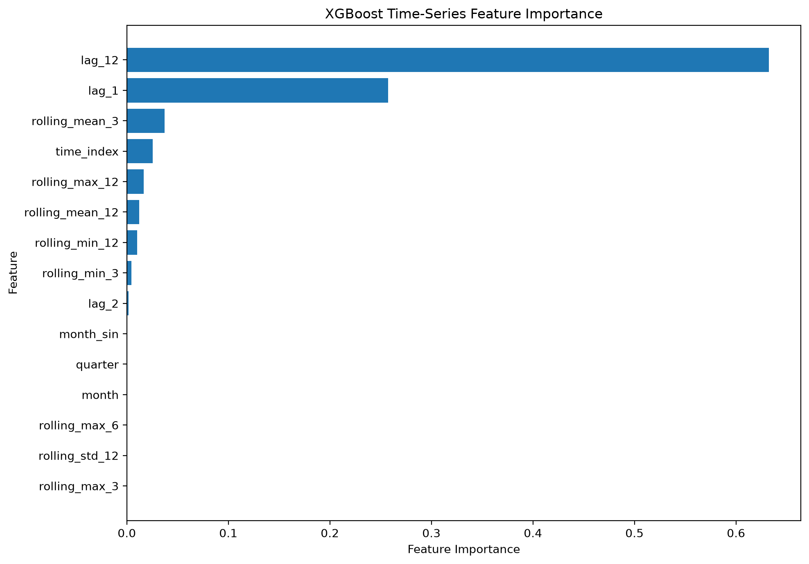

# XGBoost Time-Series Forecasting

## Overview

XGBoost is a gradient-boosted decision-tree algorithm.

It is not inherently a time-series model. Historical time-series observations must first be converted into supervised-learning features.

This implementation uses:

- lag features;
- rolling statistics;
- calendar variables;
- cyclical month features;
- a time index.

## Business Applications

XGBoost time-series forecasting can support:

- sales forecasting;
- demand planning;
- workforce forecasting;
- inventory prediction;
- energy-demand forecasting;
- operational-volume forecasting;
- feature-rich business forecasting.

## Correct Time-Series Split

The data are separated chronologically:

```text
Past observations → training data
Future observations → held-out test data
```

The latest 24 months are reserved for testing.

No random shuffling is used.

## Supervised Transformation

The original series is transformed from:

```text
Date → Value
```

into:

```text
Historical lag features
+ rolling features
+ calendar features
→ current target value
```

Example:

```text
lag_1
lag_2
lag_3
lag_6
lag_12
rolling_mean_3
rolling_mean_6
rolling_mean_12
month
month_sin
month_cos
→ current value
```

## Lag Features

A lag feature represents an earlier value.

For example:

```text
lag_1 = previous month
lag_12 = same relative period one year earlier
```

Lag features allow XGBoost to learn temporal dependence.

## Rolling Features

Rolling features summarize recent historical observations.

This project includes:

- rolling mean;
- rolling standard deviation;
- rolling minimum;
- rolling maximum.

All rolling features use earlier observations only.

## Calendar Features

Calendar variables include:

- month;
- quarter;
- sine-transformed month;
- cosine-transformed month.

Sine and cosine transformations represent the cyclical relationship between December and January.

## Time-Aware Validation

The latest 24 feature rows inside the training period are reserved for model selection.

Candidate models are evaluated using chronological validation MAE.

The final held-out test period is never used during tuning.

## Recursive Forecasting

The first future month uses only known historical observations.

After predicting the first month, that prediction is added to history and used to create features for the second month.

```text
Predict period 1
        ↓
Add prediction to history
        ↓
Predict period 2
        ↓
Continue recursively
```

Recursive forecasting can accumulate errors across longer horizons.

## Model Configuration

The selected model uses the best candidate configuration based on chronological validation.

Typical parameters include:

- `n_estimators`;
- `learning_rate`;
- `max_depth`;
- `min_child_weight`;
- `subsample`;
- `colsample_bytree`;
- `reg_alpha`;
- `reg_lambda`.

## Baselines

The model is compared with:

1. naïve forecasting;
2. seasonal-naïve forecasting.

The seasonal-naïve baseline repeats the corresponding value from the previous year.

## Evaluation Metrics

The project reports:

- MAE;
- MSE;
- RMSE;
- MAPE;
- sMAPE;
- seasonal MASE;
- improvement over naïve forecasting;
- improvement over seasonal-naïve forecasting.

## Feature Importance

Feature importance indicates which engineered variables contributed most strongly to the fitted boosted trees.

High importance does not prove causality.

Correlated features can share or redistribute importance.

## Forecast Intervals

The current implementation produces point forecasts only.

Prediction intervals can later be added using:

- quantile regression;
- conformal prediction;
- bootstrapping;
- separate lower and upper quantile models.

## Output Files

```text
outputs/
├── figures/
│   ├── train_test_split.png
│   ├── held_out_forecast.png
│   ├── baseline_comparison.png
│   ├── error_by_horizon.png
│   └── feature_importance.png
├── metrics/
│   ├── training_summary.json
│   ├── candidate_models.csv
│   ├── feature_importance.csv
│   └── metrics.json
└── predictions/
    └── test_forecasts.csv
```

## Run

```powershell
python 08_time_series/xgboost_time_series/src/train.py
python 08_time_series/xgboost_time_series/src/evaluate.py
python 08_time_series/xgboost_time_series/src/predict.py
```

## Results

### Chronological Split



### Held-Out Forecast



### Baseline Comparison



### Error by Forecast Horizon



### Feature Importance



## Strengths

- Learns nonlinear relationships.
- Supports many engineered features.
- Handles feature interactions.
- Can include external variables.
- Provides strong structured-data performance.
- Supports regularization.
- Produces feature-importance values.

## Limitations

- Does not understand time order automatically.
- Requires careful feature engineering.
- Recursive forecasts can accumulate errors.
- Ordinary feature importance is not causal.
- Forecast intervals are not included here.
- Structural changes can reduce performance.
- Random train-test splitting would create misleading results.

## Additional Documentation

- [Detailed Result Interpretation](RESULT_INTERPRETATION.md)