# AI Algorithms Lab

A practical artificial intelligence and machine-learning reference library containing clear explanations, reproducible Python implementations, held-out evaluation workflows, visualizations, result interpretation, and real-world business use cases.

## Purpose

This repository demonstrates:

- how major AI and machine-learning algorithms work;
- when each algorithm should be considered;
- how data should be prepared;
- how models should be trained and evaluated;
- how results should be interpreted;
- where algorithms can be applied in practical systems.

The repository is designed as both:

1. a personal AI-learning laboratory;
2. a practical reference for students, developers, and professionals selecting suitable algorithms.

## AI Algorithms Lab Structure

```mermaid
flowchart TD
    A["AI Algorithms Lab"]

    A --> B["Supervised Learning"]
    A --> C["Unsupervised Learning"]
    A --> D["Time-Series Learning"]
    A --> E["Recommendation Systems"]
    A --> F["Optimization"]
    A --> G["Evaluation and Validation"]

    B --> B1["Classification"]
    B --> B2["Regression"]

    C --> C1["Clustering"]
    C --> C2["Dimensionality Reduction"]
    C --> C3["Anomaly Detection"]
    C --> C4["Association-Rule Mining"]

    D --> D1["Forecasting"]
    D --> D2["Temporal Pattern Analysis"]

    E --> E1["Content-Based Filtering"]
    E --> E2["Collaborative Filtering"]
    E --> E3["Matrix Factorization"]

    F --> F1["Model Optimization"]
    F --> F2["Hyperparameter Optimization"]

    G --> G1["Classification Metrics"]
    G --> G2["Regression Metrics"]
    G --> G3["Clustering Metrics"]
    G --> G4["Validation Methods"]
```



## Detailed Algorithm Maps

Use these visual guides to understand how the algorithms are categorized and select a suitable starting method.

- [Supervised Learning Map](assets/diagrams/supervised_learning.md)
- [Unsupervised Learning Map](assets/diagrams/unsupervised_learning.md)
- [Time-Series Learning Map](assets/diagrams/time_series.md)
- [Recommendation Systems Map](assets/diagrams/recommendation_systems.md)
- [Optimization and Evaluation Map](assets/diagrams/optimization_evaluation.md)
- [AI Algorithm Selection Guide](assets/diagrams/algorithm_selection_guide.md)

## What Each Implementation Includes

Depending on the algorithm type, each implementation contains:

- conceptual explanation;
- mathematical intuition;
- dataset description;
- data preprocessing;
- train and test data preparation where meaningful;
- model fitting or pattern discovery;
- separate training, evaluation, and example inference workflows;
- evaluation metrics;
- visualizations;
- detailed result interpretation;
- business use cases;
- strengths and limitations;
- practical recommendations;
- saved outputs and reproducible configuration.

## Main Topics

1. Classification
2. Regression
3. Clustering
4. Dimensionality Reduction
5. Anomaly Detection
6. Recommendation Systems
7. Association-Rule Mining
8. Time-Series Forecasting
9. Model Optimization
10. Evaluation and Validation

---

# Algorithm Categories

## 1. Classification

Classification predicts a discrete class or category.

Planned and completed algorithms include:

- Logistic Regression
- Decision Tree Classification
- Random Forest Classification
- Support Vector Machine
- K-Nearest Neighbors
- Gaussian Naive Bayes
- XGBoost Classification

Example applications:

- fraud detection;
- medical-risk classification;
- customer churn prediction;
- spam detection;
- sentiment classification.

## 2. Regression

Regression predicts a continuous numerical value.

Planned and completed algorithms include:

- Linear Regression
- Polynomial Regression
- Ridge Regression
- Lasso Regression
- Decision Tree Regression
- Random Forest Regression
- XGBoost Regression

Example applications:

- house-price prediction;
- sales prediction;
- delivery-time estimation;
- demand estimation;
- customer lifetime-value prediction.

## 3. Clustering

Clustering discovers groups within data without requiring target labels.

Planned and completed algorithms include:

- K-Means
- Hierarchical Clustering
- DBSCAN
- HDBSCAN
- Gaussian Mixture Models

Example applications:

- customer segmentation;
- product grouping;
- market segmentation;
- behavioural pattern discovery;
- noise and outlier identification.

## 4. Dimensionality Reduction

Dimensionality-reduction techniques represent data using fewer variables while attempting to preserve useful structure.

Planned and completed algorithms include:

- Principal Component Analysis
- Linear Discriminant Analysis
- t-SNE
- UMAP

Example applications:

- data visualization;
- feature compression;
- multicollinearity reduction;
- preprocessing for clustering;
- preprocessing for predictive models.

## 5. Anomaly Detection

Anomaly-detection algorithms identify unusual observations that differ from the expected data distribution.

Planned and completed algorithms include:

- Isolation Forest
- Local Outlier Factor
- One-Class SVM
- Autoencoder Anomaly Detection

Example applications:

- fraud-screening support;
- cybersecurity monitoring;
- equipment-condition monitoring;
- process-deviation detection;
- data-quality analysis.

## 6. Recommendation Systems

Recommendation systems rank or suggest relevant items.

Planned algorithms include:

- Content-Based Filtering
- Collaborative Filtering
- Matrix Factorization
- Hybrid Recommendation Systems

Example applications:

- product recommendations;
- content recommendations;
- course recommendations;
- service suggestions;
- personalized ranking.

## 7. Association-Rule Mining

Association-rule algorithms identify items or events that frequently occur together.

Planned and completed algorithms include:

- Apriori
- FP-Growth
- ECLAT

Example applications:

- market-basket analysis;
- cross-selling;
- product bundling;
- promotional planning;
- basket-based recommendations.

## 8. Time-Series Forecasting

Time-series algorithms model chronologically ordered observations.

Planned algorithms include:

- Moving Average
- Exponential Smoothing
- ARIMA
- SARIMA
- Prophet

Example applications:

- sales forecasting;
- demand forecasting;
- workforce forecasting;
- financial forecasting;
- seasonal trend analysis.

## 9. Optimization

Optimization techniques improve model parameters, hyperparameters, or objective functions.

Planned algorithms and methods include:

- Gradient Descent
- Grid Search
- Randomized Search
- Bayesian Optimization

## 10. Evaluation and Validation

Evaluation methods measure performance, generalization, stability, and operational usefulness.

Planned topics include:

- classification metrics;
- regression metrics;
- clustering metrics;
- anomaly-detection metrics;
- recommendation metrics;
- forecasting metrics;
- cross-validation;
- threshold analysis;
- calibration;
- residual analysis.

---

# Standard Project Structure

Most model-based algorithm folders follow this structure:

```text
algorithm_name/
├── README.md
├── RESULT_INTERPRETATION.md
├── data/
│   ├── train_data.csv
│   └── test_data.csv
├── models/
│   └── .gitkeep
├── outputs/
│   ├── figures/
│   ├── metrics/
│   └── predictions/
└── src/
    ├── train.py
    ├── evaluate.py
    └── predict.py
```

Some algorithms use slightly different structures because their workflows are different.

Examples:

- PCA uses transformed-data and reconstruction outputs.
- Apriori saves frequent itemsets and association rules.
- DBSCAN uses approximate assignment because it has no native prediction method.
- Time-series algorithms use chronological training and future test periods.
- Evaluation-metric folders may use dedicated metric scripts instead of `train.py`.

## File Responsibilities

### `train.py`

Typically:

- loads the dataset;
- prepares training and held-out data;
- fits preprocessing using training data only;
- trains or fits the algorithm;
- saves the model or learned artifacts;
- saves reproducible configuration information.

### `evaluate.py`

Typically:

- loads the saved model or learned artifacts;
- loads held-out evaluation data;
- generates predictions, transformations, clusters, or rules;
- calculates relevant metrics;
- creates visualizations;
- saves detailed evaluation outputs.

### `predict.py`

Typically:

- loads the saved model;
- loads one held-out example;
- produces an example prediction, transformation, assignment, score, or recommendation;
- compares it with the known result where applicable.

The example is used to demonstrate inference and should not be interpreted as independent external validation.

### `RESULT_INTERPRETATION.md`

Explains:

- what the metrics mean;
- how to read the visualizations;
- what the outputs imply;
- important assumptions;
- business interpretation;
- limitations;
- responsible-use considerations;
- possible improvements.

---

# Data-Preparation Standards

## Supervised Learning

```text
Full labelled dataset
        ↓
Train-test split
        ↓
Fit preprocessing on training data
        ↓
Train model using training data
        ↓
Evaluate using held-out test data
        ↓
Predict one held-out example
```

## Unsupervised Learning

Where meaningful:

```text
Full feature dataset
        ↓
Train-test split
        ↓
Fit preprocessing on training data
        ↓
Fit unsupervised method on training data
        ↓
Transform or assign held-out observations
        ↓
Evaluate structure and stability
```

Some exploratory clustering implementations may also analyse the full dataset. Such cases are explained clearly in their individual documentation.

## Time-Series Learning

```text
Chronological dataset
        ↓
Past observations used for training
        ↓
Future observations held out for testing
        ↓
Forecast future period
        ↓
Compare forecast with actual future values
```

Random shuffling is not used for ordinary time-series forecasting.

---

# Implementation Progress

| Category | Algorithm | Status |
|---|---|---|
| Classification | Logistic Regression | Complete |
| Regression | Linear Regression | Complete |
| Classification | Decision Tree Classification | Complete |
| Classification | Random Forest Classification | Complete |
| Classification | K-Nearest Neighbors | Complete |
| Classification | Support Vector Machine | Complete |
| Classification | Gaussian Naive Bayes | Complete |
| Clustering | K-Means | Complete |
| Clustering | DBSCAN | Complete |
| Dimensionality Reduction | Principal Component Analysis | Complete |
| Anomaly Detection | Isolation Forest | Complete |
| Association Rules | Apriori | Complete |
| Time Series | ARIMA | Next |
| Classification | XGBoost Classification | Planned |
| Regression | Ridge Regression | Planned |
| Regression | Lasso Regression | Planned |
| Clustering | Hierarchical Clustering | Planned |
| Recommendation Systems | Content-Based Filtering | Planned |
| Optimization | Grid Search | Planned |
| Evaluation | Model Comparison Dashboard | Planned |

---

# Technology Stack

- Python
- pandas
- NumPy
- scikit-learn
- Matplotlib
- mlxtend
- XGBoost
- statsmodels
- Prophet
- joblib
- Git
- GitHub

Additional libraries will be introduced as the repository expands.

---

# Current Learning Coverage

The completed implementations currently demonstrate:

- supervised learning;
- unsupervised learning;
- binary classification;
- continuous-value prediction;
- linear models;
- tree-based models;
- ensemble learning;
- distance-based learning;
- kernel methods;
- probabilistic classification;
- centroid-based clustering;
- density-based clustering;
- dimensionality reduction;
- anomaly detection;
- association-rule mining;
- train-test separation;
- preprocessing pipelines;
- model persistence;
- held-out evaluation;
- visualization;
- result interpretation.

---

# Responsible Use

The datasets and applications in this repository are primarily educational demonstrations.

Models must not automatically be used for:

- medical diagnosis;
- financial approval;
- employment decisions;
- legal decisions;
- safety-critical operations;
- high-risk automated decision-making.

Real deployment would require:

- domain validation;
- external testing;
- privacy protection;
- fairness assessment;
- security controls;
- monitoring;
- drift detection;
- human oversight;
- documented accountability.

---

# Author

**Sampath Bandaranayake**

M.Sc. Digital Business & Innovation student at Tokyo International University, with an MBA and B.Sc. in Applied Sciences.

Areas of interest:

- AI Application Development
- Agentic AI
- Machine Learning
- Enterprise AI
- Business Process Intelligence
- AI Product Development
- Digital Transformation

---

# Repository Status

This repository is under active development.

Algorithms, comparisons, diagrams, business examples, testing workflows, and documentation are being added progressively.