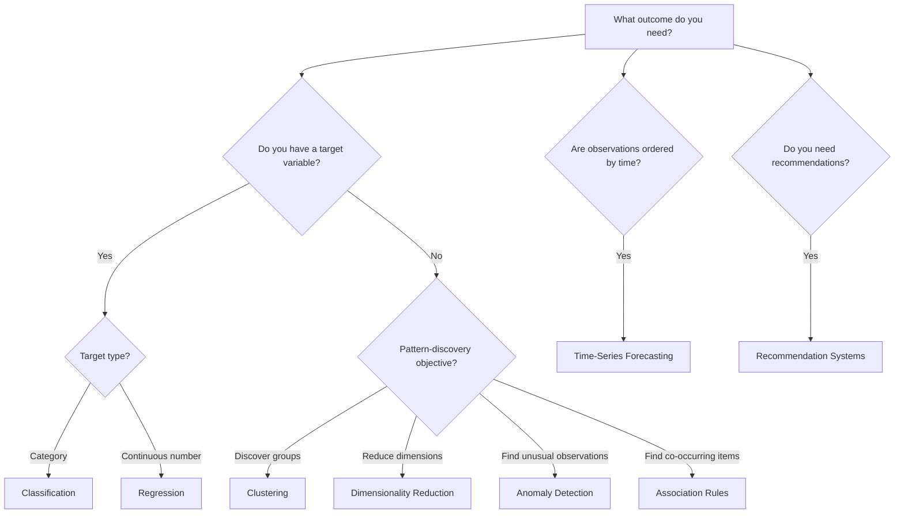
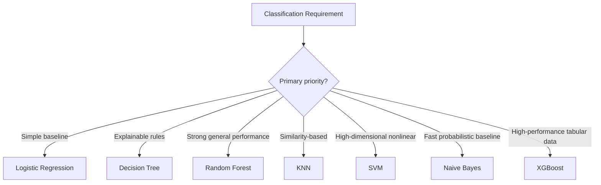
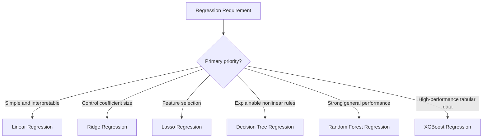
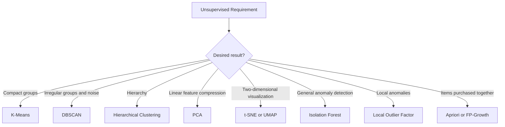

# AI Algorithm Selection Guide

This guide identifies a suitable starting category. Final selection should be based on experiments, validation, interpretability, and business requirements.



## Classification Selection



## Regression Selection



## Unsupervised Selection



## Selection Checklist

Before choosing a final algorithm, examine:

1. Is the target labelled?
2. Is the target categorical, numerical, or temporal?
3. How many observations and features are available?
4. Are classes imbalanced?
5. Is explainability required?
6. How costly are false positives and false negatives?
7. Is prediction latency important?
8. Does the model need probability estimates?
9. Can the model be monitored after deployment?
10. Does a simpler baseline perform nearly as well?

## Professional Model-Selection Process

```text
Define the business problem
        ↓
Prepare train and test data
        ↓
Build a simple baseline
        ↓
Test several suitable algorithms
        ↓
Compare relevant evaluation metrics
        ↓
Consider interpretability and cost
        ↓
Select and validate the final solution
```