# AI Algorithm Selection Guide

Use this guide as an initial decision path. Final algorithm selection should also consider dataset size, data quality, interpretability, computational cost, and evaluation results.

```mermaid
flowchart TD
    A["What problem are you solving?"]

    A --> B{"Do you have a target variable?"}

    B -->|Yes| C{"What type of target?"}
    B -->|No| D{"What outcome do you need?"}

    C -->|Category or class| E["Classification"]
    C -->|Continuous number| F["Regression"]
    C -->|Future values ordered by time| G["Time-Series Forecasting"]

    E --> E1{"Main requirement?"}

    E1 -->|Simple and interpretable| E2["Logistic Regression"]
    E1 -->|Explainable rules| E3["Decision Tree"]
    E1 -->|Strong general performance| E4["Random Forest or XGBoost"]
    E1 -->|Similarity-based prediction| E5["K-Nearest Neighbors"]
    E1 -->|High-dimensional nonlinear boundary| E6["Support Vector Machine"]
    E1 -->|Fast probabilistic baseline| E7["Naive Bayes"]

    F --> F1{"Main requirement?"}

    F1 -->|Linear and interpretable| F2["Linear Regression"]
    F1 -->|Control multicollinearity| F3["Ridge Regression"]
    F1 -->|Feature selection| F4["Lasso Regression"]
    F1 -->|Nonlinear rules| F5["Decision Tree Regression"]
    F1 -->|Strong ensemble prediction| F6["Random Forest or XGBoost Regression"]

    G --> G1{"Time-series characteristics?"}

    G1 -->|Simple trend or level| G2["Moving Average or Exponential Smoothing"]
    G1 -->|Autocorrelation and stationary structure| G3["ARIMA"]
    G1 -->|Seasonal structure| G4["SARIMA"]
    G1 -->|Trend, seasonality and holidays| G5["Prophet"]

    D --> D1{"Desired result?"}

    D1 -->|Discover groups| H["Clustering"]
    D1 -->|Reduce feature dimensions| I["Dimensionality Reduction"]
    D1 -->|Find unusual records| J["Anomaly Detection"]
    D1 -->|Find items occurring together| K["Association Rules"]
    D1 -->|Recommend items to users| L["Recommendation Systems"]

    H --> H1{"Expected cluster structure?"}

    H1 -->|Compact groups and known cluster count| H2["K-Means"]
    H1 -->|Irregular shapes and noise| H3["DBSCAN"]
    H1 -->|Hierarchy or dendrogram required| H4["Hierarchical Clustering"]
    H1 -->|Different densities| H5["HDBSCAN"]
    H1 -->|Probabilistic membership| H6["Gaussian Mixture Model"]

    I --> I1{"Purpose?"}

    I1 -->|Linear compression| I2["PCA"]
    I1 -->|Supervised class separation| I3["LDA"]
    I1 -->|Two-dimensional visualization| I4["t-SNE or UMAP"]

    J --> J1{"Available labels?"}

    J1 -->|No anomaly labels| J2["Isolation Forest or LOF"]
    J1 -->|Mostly normal training data| J3["One-Class SVM"]
    J1 -->|Large complex data| J4["Autoencoder"]
    J1 -->|Labelled normal and anomaly data| J5["Supervised Classification"]

    K --> K1{"Dataset size and requirement?"}

    K1 -->|Clear educational baseline| K2["Apriori"]
    K1 -->|Large transaction dataset| K3["FP-Growth"]
    K1 -->|Vertical item representation| K4["ECLAT"]

    L --> L1{"Available information?"}

    L1 -->|Item attributes| L2["Content-Based Filtering"]
    L1 -->|User-item interactions| L3["Collaborative Filtering"]
    L1 -->|Sparse rating matrix| L4["Matrix Factorization"]
```

## Important Reminder

This guide selects an initial candidate algorithm, not a guaranteed final model.

A professional workflow should:

1. establish a baseline;
2. test multiple suitable algorithms;
3. use train-test or time-based validation;
4. compare relevant metrics;
5. consider interpretability and operational cost;
6. select the model that best fits the real requirement.
