# AI Algorithms Lab — Algorithm Taxonomy

This diagram organizes the algorithms and concepts covered in the AI Algorithms Lab.

```mermaid
flowchart TD
    A["AI Algorithms Lab"]

    A --> B["Supervised Learning"]
    A --> C["Unsupervised Learning"]
    A --> D["Recommendation Systems"]
    A --> E["Time-Series Learning"]
    A --> F["Optimization"]
    A --> G["Evaluation and Validation"]

    B --> B1["Classification"]
    B --> B2["Regression"]

    B1 --> B11["Logistic Regression"]
    B1 --> B12["Decision Tree"]
    B1 --> B13["Random Forest"]
    B1 --> B14["K-Nearest Neighbors"]
    B1 --> B15["Support Vector Machine"]
    B1 --> B16["Gaussian Naive Bayes"]
    B1 --> B17["XGBoost Classification"]

    B2 --> B21["Linear Regression"]
    B2 --> B22["Polynomial Regression"]
    B2 --> B23["Ridge Regression"]
    B2 --> B24["Lasso Regression"]
    B2 --> B25["Decision Tree Regression"]
    B2 --> B26["Random Forest Regression"]
    B2 --> B27["XGBoost Regression"]

    C --> C1["Clustering"]
    C --> C2["Dimensionality Reduction"]
    C --> C3["Anomaly Detection"]
    C --> C4["Association-Rule Mining"]

    C1 --> C11["K-Means"]
    C1 --> C12["DBSCAN"]
    C1 --> C13["Hierarchical Clustering"]
    C1 --> C14["HDBSCAN"]
    C1 --> C15["Gaussian Mixture Model"]

    C2 --> C21["PCA"]
    C2 --> C22["Linear Discriminant Analysis"]
    C2 --> C23["t-SNE"]
    C2 --> C24["UMAP"]

    C3 --> C31["Isolation Forest"]
    C3 --> C32["Local Outlier Factor"]
    C3 --> C33["One-Class SVM"]
    C3 --> C34["Autoencoder"]

    C4 --> C41["Apriori"]
    C4 --> C42["FP-Growth"]
    C4 --> C43["ECLAT"]

    D --> D1["Content-Based Filtering"]
    D --> D2["Collaborative Filtering"]
    D --> D3["Matrix Factorization"]

    E --> E1["Moving Average"]
    E --> E2["Exponential Smoothing"]
    E --> E3["ARIMA"]
    E --> E4["SARIMA"]
    E --> E5["Prophet"]

    F --> F1["Gradient Descent"]
    F --> F2["Grid Search"]
    F --> F3["Randomized Search"]
    F --> F4["Bayesian Optimization"]

    G --> G1["Classification Metrics"]
    G --> G2["Regression Metrics"]
    G --> G3["Clustering Metrics"]
    G --> G4["Cross-Validation"]
    G --> G5["Threshold Analysis"]
```

## Category Notes

### Supervised Learning

Uses labelled examples containing both input features and expected outputs.

### Unsupervised Learning

Discovers structures or patterns without a required target label.

### Recommendation Systems

Predicts user preferences or ranks items according to relevance.

### Time-Series Learning

Models data whose chronological order is important.

### Optimization

Improves model parameters, hyperparameters, or objective functions.

### Evaluation and Validation

Measures performance, generalization, stability, and operational usefulness.
