# Optimization and Evaluation Map

Optimization improves models or objective functions. Evaluation measures whether the resulting system performs reliably.

```mermaid
flowchart TD
    A["Optimization and Evaluation"]

    A --> B["Optimization"]
    A --> C["Evaluation Metrics"]
    A --> D["Validation Methods"]
    A --> E["Interpretability"]
    A --> F["Operational Evaluation"]

    B --> B1["Gradient-Based Optimization"]
    B --> B2["Hyperparameter Search"]
    B --> B3["Feature Optimization"]
    B --> B4["Threshold Optimization"]

    B1 --> B11["Gradient Descent"]
    B1 --> B12["Stochastic Gradient Descent"]
    B1 --> B13["Adam"]

    B2 --> B21["Grid Search"]
    B2 --> B22["Randomized Search"]
    B2 --> B23["Bayesian Optimization"]

    B3 --> B31["Feature Selection"]
    B3 --> B32["Regularization"]
    B3 --> B33["Dimensionality Reduction"]

    B4 --> B41["Precision-Recall Trade-Off"]
    B4 --> B42["Cost-Based Threshold"]
    B4 --> B43["Business-Risk Threshold"]

    C --> C1["Classification Metrics"]
    C --> C2["Regression Metrics"]
    C --> C3["Clustering Metrics"]
    C --> C4["Ranking Metrics"]
    C --> C5["Forecasting Metrics"]

    D --> D1["Train-Test Split"]
    D --> D2["K-Fold Cross-Validation"]
    D --> D3["Stratified Cross-Validation"]
    D --> D4["Group Cross-Validation"]
    D --> D5["Time-Series Validation"]

    E --> E1["Coefficients"]
    E --> E2["Feature Importance"]
    E --> E3["Permutation Importance"]
    E --> E4["SHAP"]
    E --> E5["Partial Dependence"]

    F --> F1["Latency"]
    F --> F2["Memory"]
    F --> F3["Drift"]
    F --> F4["Fairness"]
    F --> F5["Reliability"]
    F --> F6["Business Impact"]
```

## Model Evaluation Is More Than Accuracy

A production model should be evaluated across:

- predictive performance;
- generalization;
- interpretability;
- computational cost;
- fairness;
- stability;
- business usefulness;
- monitoring requirements.

## Validation Selection

| Data Situation | Validation Method |
|---|---|
| Independent labelled rows | Train-test split |
| Limited labelled data | K-fold cross-validation |
| Imbalanced classification | Stratified cross-validation |
| Repeated users or organizations | Group cross-validation |
| Chronological observations | Time-series split |
| Model tuning | Nested validation when appropriate |

## Avoid Data Leakage

Preprocessing should generally be fitted only on training data.

This includes:

- feature scaling;
- missing-value imputation;
- feature selection;
- PCA;
- oversampling;
- target encoding;
- model tuning.

Use a pipeline where possible.