# Recommendation Systems Map

Recommendation systems rank or suggest items that may be relevant to a user, organization, or context.

```mermaid
flowchart TD
    A["Recommendation Systems"]

    A --> B["Non-Personalized"]
    A --> C["Content-Based Filtering"]
    A --> D["Collaborative Filtering"]
    A --> E["Matrix Factorization"]
    A --> F["Hybrid Recommendation"]
    A --> G["Association-Based Recommendation"]

    B --> B1["Popular Items"]
    B --> B2["Trending Items"]
    B --> B3["Top-Rated Items"]

    C --> C1["Item Attributes"]
    C --> C2["User Profile"]
    C --> C3["Similarity Search"]

    D --> D1["User-Based Collaborative Filtering"]
    D --> D2["Item-Based Collaborative Filtering"]

    E --> E1["Singular Value Decomposition"]
    E --> E2["Alternating Least Squares"]
    E --> E3["Neural Collaborative Filtering"]

    F --> F1["Content and Collaborative Combination"]
    F --> F2["Rule-Based Re-Ranking"]
    F --> F3["Context-Aware Recommendation"]

    G --> G1["Apriori Rules"]
    G --> G2["FP-Growth Rules"]
    G --> G3["Basket Recommendations"]
```



## Initial Selection

| Available Information | Suitable Method |
|---|---|
| No user history | Popularity baseline |
| Item descriptions or attributes | Content-based filtering |
| User-item interaction data | Collaborative filtering |
| Sparse rating matrix | Matrix factorization |
| Multiple data sources | Hybrid recommendation |
| Shopping baskets | Association rules |

## Common Challenges

- cold-start users;
- cold-start items;
- sparse interaction data;
- popularity bias;
- filter bubbles;
- changing preferences;
- scalability;
- evaluation without harming users.

## Offline Evaluation

- Precision@K
- Recall@K
- Mean Average Precision
- Mean Reciprocal Rank
- Normalized Discounted Cumulative Gain
- Hit Rate
- Coverage
- Diversity
- Novelty

## Business Evaluation

Offline performance should be combined with:

- click-through rate;
- conversion rate;
- average order value;
- retention;
- user satisfaction;
- recommendation diversity;
- long-term engagement.

## Correct Workflow

```text
User-item interaction data
        ↓
Chronological or user-aware split
        ↓
Training interactions
        ↓
Held-out interactions
        ↓
Generate ranked recommendations
        ↓
Evaluate whether held-out relevant items appear
```