# Supervised Learning Algorithm Map

Supervised-learning algorithms learn from labelled examples containing input features and known target outputs.

```mermaid
flowchart TD
    A["Supervised Learning"]

    A --> B["Classification"]
    A --> C["Regression"]

    B --> B1["Linear and Probabilistic Models"]
    B --> B2["Tree-Based Models"]
    B --> B3["Distance-Based Models"]
    B --> B4["Margin and Kernel Models"]
    B --> B5["Boosting Models"]

    B1 --> B11["Logistic Regression"]
    B1 --> B12["Gaussian Naive Bayes"]
    B1 --> B13["Multinomial Naive Bayes"]
    B1 --> B14["Bernoulli Naive Bayes"]

    B2 --> B21["Decision Tree Classification"]
    B2 --> B22["Random Forest Classification"]

    B3 --> B31["K-Nearest Neighbors"]

    B4 --> B41["Linear Support Vector Machine"]
    B4 --> B42["RBF Support Vector Machine"]

    B5 --> B51["Gradient Boosting"]
    B5 --> B52["XGBoost Classification"]
    B5 --> B53["LightGBM Classification"]
    B5 --> B54["CatBoost Classification"]

    C --> C1["Linear Regression Models"]
    C --> C2["Tree-Based Regression"]
    C --> C3["Distance-Based Regression"]
    C --> C4["Kernel Regression"]
    C --> C5["Boosting Regression"]

    C1 --> C11["Linear Regression"]
    C1 --> C12["Polynomial Regression"]
    C1 --> C13["Ridge Regression"]
    C1 --> C14["Lasso Regression"]
    C1 --> C15["Elastic Net"]

    C2 --> C21["Decision Tree Regression"]
    C2 --> C22["Random Forest Regression"]

    C3 --> C31["K-Nearest Neighbors Regression"]

    C4 --> C41["Support Vector Regression"]

    C5 --> C51["Gradient Boosting Regression"]
    C5 --> C52["XGBoost Regression"]
    C5 --> C53["LightGBM Regression"]
    C5 --> C54["CatBoost Regression"]
```



## Classification

Classification predicts a category or class.

Examples:

- fraud or legitimate;
- malignant or benign;
- customer churn or retention;
- spam or non-spam;
- product category;
- sentiment class.

## Regression

Regression predicts a continuous numerical value.

Examples:

- house price;
- sales amount;
- delivery time;
- customer lifetime value;
- energy demand;
- temperature.

## Initial Algorithm Selection

| Requirement | Suitable Starting Algorithm |
|---|---|
| Simple binary classification | Logistic Regression |
| Transparent decision rules | Decision Tree |
| Strong general-purpose classification | Random Forest |
| Similarity-based prediction | KNN |
| High-dimensional nonlinear separation | SVM |
| Fast probabilistic baseline | Naive Bayes |
| High-performance structured data | XGBoost |
| Simple numerical prediction | Linear Regression |
| Multicollinearity control | Ridge Regression |
| Automatic feature reduction | Lasso Regression |
| Nonlinear numerical relationships | Random Forest Regression |

## Important Evaluation Methods

### Classification

- Accuracy
- Balanced accuracy
- Precision
- Recall
- F1-score
- ROC-AUC
- Average precision
- Confusion matrix
- Calibration

### Regression

- Mean Absolute Error
- Mean Squared Error
- Root Mean Squared Error
- R-squared
- Adjusted R-squared
- Residual analysis

## Correct Workflow

```text
Full labelled dataset
        ↓
Train-test split
        ↓
Fit preprocessing on training data
        ↓
Train model using training data
        ↓
Evaluate using held-out test data
        ↓
Predict one held-out example
```

## Important Reminder

The best algorithm should not be selected only by metric performance.

Also consider:

- interpretability;
- business risk;
- inference speed;
- training cost;
- data volume;
- class imbalance;
- deployment environment;
- monitoring requirements.