# Time-Series Learning Map

Time-series methods analyse observations whose chronological order is important.

```mermaid
flowchart TD
    A["Time-Series Learning"]

    A --> B["Baseline Methods"]
    A --> C["Statistical Forecasting"]
    A --> D["Machine-Learning Forecasting"]
    A --> E["Deep-Learning Forecasting"]
    A --> F["Temporal Anomaly Detection"]

    B --> B1["Naive Forecast"]
    B --> B2["Moving Average"]
    B --> B3["Seasonal Naive"]

    C --> C1["Exponential Smoothing"]
    C --> C2["Holt Method"]
    C --> C3["Holt-Winters"]
    C --> C4["ARIMA"]
    C --> C5["SARIMA"]
    C --> C6["VAR"]

    D --> D1["Random Forest with Lag Features"]
    D --> D2["XGBoost with Lag Features"]
    D --> D3["Prophet"]

    E --> E1["Recurrent Neural Network"]
    E --> E2["LSTM"]
    E --> E3["GRU"]
    E --> E4["Temporal Transformer"]

    F --> F1["Residual-Based Detection"]
    F --> F2["Isolation Forest on Temporal Features"]
    F --> F3["Autoencoder"]
```



## Important Difference

Time-series data must normally be split chronologically.

Do not randomly shuffle future observations into the training set.

```text
Past observations → training data
Future observations → held-out test data
```

## Initial Selection

| Scenario | Starting Method |
|---|---|
| Simple baseline | Naive or moving average |
| Level without complex trend | Exponential smoothing |
| Trend | Holt method |
| Trend and seasonality | Holt-Winters |
| Autocorrelation | ARIMA |
| Seasonal autocorrelation | SARIMA |
| Multiple related time series | VAR |
| Holidays and multiple seasonal effects | Prophet |
| Nonlinear feature-rich forecasting | XGBoost |
| Long complex temporal patterns | LSTM or Transformer |

## Evaluation Metrics

- Mean Absolute Error
- Mean Squared Error
- Root Mean Squared Error
- Mean Absolute Percentage Error
- Symmetric MAPE
- Mean Absolute Scaled Error
- Prediction interval coverage

## Correct Workflow

```text
Chronological dataset
        ↓
Training period
        ↓
Validation period
        ↓
Held-out future test period
        ↓
Fit using past observations only
        ↓
Forecast future observations
        ↓
Compare forecast with actual future values
```

## Important Reminder

Always compare advanced time-series models against a simple baseline.

A complex model should not be selected when it cannot outperform a naive or seasonal-naive forecast.