# Unsupervised Learning Algorithm Map

Unsupervised-learning methods discover patterns, groups, structures, or unusual observations without requiring a target variable.

```mermaid
flowchart TD
    A["Unsupervised Learning"]

    A --> B["Clustering"]
    A --> C["Dimensionality Reduction"]
    A --> D["Anomaly Detection"]
    A --> E["Association-Rule Mining"]

    B --> B1["Centroid-Based"]
    B --> B2["Density-Based"]
    B --> B3["Hierarchical"]
    B --> B4["Probabilistic"]

    B1 --> B11["K-Means"]
    B1 --> B12["MiniBatch K-Means"]

    B2 --> B21["DBSCAN"]
    B2 --> B22["HDBSCAN"]
    B2 --> B23["OPTICS"]

    B3 --> B31["Agglomerative Clustering"]
    B3 --> B32["Divisive Clustering"]

    B4 --> B41["Gaussian Mixture Model"]

    C --> C1["Linear Methods"]
    C --> C2["Nonlinear Visualization"]
    C --> C3["Neural Representation"]

    C1 --> C11["Principal Component Analysis"]
    C1 --> C12["Linear Discriminant Analysis"]
    C1 --> C13["Truncated SVD"]

    C2 --> C21["t-SNE"]
    C2 --> C22["UMAP"]
    C2 --> C23["Kernel PCA"]

    C3 --> C31["Autoencoder"]

    D --> D1["Tree-Based"]
    D --> D2["Density-Based"]
    D --> D3["Boundary-Based"]
    D --> D4["Reconstruction-Based"]

    D1 --> D11["Isolation Forest"]

    D2 --> D21["Local Outlier Factor"]
    D2 --> D22["DBSCAN Noise Detection"]

    D3 --> D31["One-Class SVM"]

    D4 --> D41["Autoencoder Anomaly Detection"]

    E --> E1["Apriori"]
    E --> E2["FP-Growth"]
    E --> E3["ECLAT"]
```



## Clustering

Clustering discovers groups of similar observations.

Typical applications:

- customer segmentation;
- product grouping;
- market segmentation;
- document grouping;
- geographic hotspot discovery;
- process-pattern analysis.

### Initial Selection

| Scenario | Suggested Method |
|---|---|
| Known number of compact clusters | K-Means |
| Irregular shapes and noise | DBSCAN |
| Different cluster densities | HDBSCAN |
| Hierarchical grouping required | Agglomerative Clustering |
| Probabilistic membership needed | Gaussian Mixture Model |

## Dimensionality Reduction

Dimensionality reduction represents data using fewer variables.

Typical applications:

- visualization;
- data compression;
- multicollinearity reduction;
- noise reduction;
- preprocessing;
- feature extraction.

### Initial Selection

| Scenario | Suggested Method |
|---|---|
| Linear compression | PCA |
| Sparse text or matrix data | Truncated SVD |
| Supervised class separation | LDA |
| Two-dimensional visualization | t-SNE or UMAP |
| Nonlinear feature extraction | Autoencoder |

## Anomaly Detection

Anomaly detection identifies observations that differ from the expected pattern.

Typical applications:

- fraud screening;
- equipment monitoring;
- cybersecurity;
- process deviations;
- unusual customer behaviour;
- data-quality checks.

### Initial Selection

| Scenario | Suggested Method |
|---|---|
| General unsupervised anomaly detection | Isolation Forest |
| Local-density anomalies | Local Outlier Factor |
| Mostly normal training data | One-Class SVM |
| Complex high-dimensional observations | Autoencoder |
| Clustering and noise detection together | DBSCAN |

## Association-Rule Mining

Association-rule algorithms identify items or events that occur together.

Typical applications:

- market-basket analysis;
- cross-selling;
- product bundling;
- recommendation support;
- website-navigation patterns;
- service combinations.

### Initial Selection

| Scenario | Suggested Method |
|---|---|
| Clear educational baseline | Apriori |
| Large transaction dataset | FP-Growth |
| Vertical transaction representation | ECLAT |

## Unsupervised Evaluation

Unsupervised models do not normally have known target answers.

Possible evaluation methods include:

- silhouette score;
- Davies–Bouldin score;
- Calinski–Harabasz score;
- cluster stability;
- reconstruction error;
- explained variance;
- anomaly-score analysis;
- held-out support and confidence;
- business interpretability.

## Correct Workflow

```text
Full feature dataset
        ↓
Train-test split where meaningful
        ↓
Fit preprocessing on training data
        ↓
Fit unsupervised method on training data
        ↓
Transform or assign held-out observations
        ↓
Evaluate structure, stability, and usefulness
```

## Important Reminder

An unsupervised result is not automatically meaningful.

Clusters, anomalies, and associations require:

- domain interpretation;
- stability analysis;
- parameter testing;
- business validation;
- monitoring over time.
